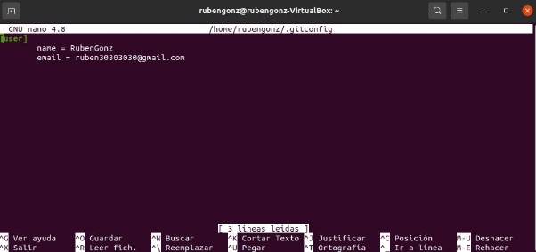

# Instalación de Git

***

## Índice de la instalación

- Conocer la versión actual de git en tu sistema
- Instalación de Git a través del sistema de paquetes
- Instalación de Git a través de la fuente
- Configurar Git

***

## Conocer la versión de git en tu sistema

La forma más sencilla de comprobar la versión actual de git en tu sistema operativo es entrar a una terminal y escribir el comando:

- git --version

La salida de este comando nos enseñará la versión que persiste en nuestro sistema. Sin embargo si no hay ninguna versión instalada te saldrá un mensaje similar a este:

***

## Instalación de git a través de paquetes

El sistema de paquetes que nos proporciona sistemas operativos como puede ser ubuntu o linux mint puede ser muy útil en casos donde no nos importa que versión específica tener. Con estos paquetes podemos instalar gran cantidad de softwares y herramientas con mucha facilidad con el inconveniente de que lo más seguro es que no contemos con la última versión disponible.

Para hacerlo siguiendo este método tendríamos que actualizar nuestro sistema de paquetes para asegurarnos de instalarnos la última versión disponible que nos proporcione el sistema. Para ello abriremos una terminal y escribiremos el comando :

- sudo apt update

Aquí te pedirá la contraseña de administrador donde tras colocarla y darle a "Enter "empezaría el proceso, dandonos una salida similar a:

Una vez este proceso termine lo siguiente sería la propia instalación de git usando los paquetes actualizados. Para iniciar la instalación usaremos:

- sudo apt install git

Tras escribir el comando empezará a cargar y pedirá confirmación, por lo que tendríamos que escribir "S" cuando nos lo pida y tras unos segundos, la instalación daría comienzo y en poco terminaría.

La manera de comprobar si realmente se ha instalado con éxito es usando el comando comentado en el primer punto del índice:

- git --version

Si lo hemos ejecutado todo correctamente la salida del comando esta vez sería: 

***

## Instalación de git a través de la fuente

El método anterior aunque es mucho más sencillo solo nos deja a nuestra dispocición las versiones que nos de nuestro sistema operativo. Obviamente no siemre querremos estas versiones por lo que si quiesiesemos una versión diferente a estas tendremos que usar este método.

De esta manera tendremos la ventaja de poder decidir qué versión instalar, no tiene porque ser la establecida en el sistema o la más actual simplemente depende de nuestro criterio o gusto.

Para hacerlo siguiendo este método tendremos que actualizar nuestro sistema de paquetes como las anteriores veces, abriendo una terminal y escribiendo el comando:

- sudo apt update

Te volverá a pedir la contraseña de administrador y tras colocarla empezará el proceso y veremos:

También necesitaremos otro software que se encuentra en el sistema de paquetes para poder instalarnos posteriormente la versión de git elegida por nosotros. Para instalarnos este software solo sería necesario poner en la terminal el comando:

- sudo apt install libz-dev libssl-dev libcurl4-gnutls-dev libexpat1-dev gettext cmake gcc

El proceso tendría un aspecto similar a:

Una vez terminado lo siguiente sería la propia instalación de Git. Para ello lo primero sería la creación de una carpeta temporal usando:

- mkdir tmp

Y a posteriori entrar en ella usando el comando:

- cd tmp

Ahora tendremos que buscar la versión de git que queramos instalar en nuestro sistema. 

Para ello accederemos a este enlace donde podemos ver todas las versiones que hay actualmente de git:

- <https://mirrors.edge.kernel.org/pub/software/scm/git/>

Una vez hemos elegido la versión que vamos a utilizar tendremos que descargarla y enviar el archivo a git.tar.gz, para ello usaremos la funcionalidad curl. 

En el caso de que no tengamos descargado este software haremos:

- sudo apt install curl # version 7.68.0-1ubuntu2.7

Ahora ya podremos bajarnos la version usando el comando:

- curl -o git.tar.gz <https://mirrors.edge.kernel.org/pub/software/scm/git>/git-(versión elegida).tar.gz

En nuestro caso:

- curl -o git.tar.gz https://mirrors.edge.kernel.org/pub/software/scm/git/git-2.29.3.tar.gz

Y posteriormente a ello descomprimir el archivo usando:

- tar -zxf git.tar.gz

Ahora que ya lo tenemos descomprimido, podemos ir al directorio creado usando el comando cd.

- cd git-(versión elegida)

En nuestro caso:

- cd git-2.29.3

Dentro de esta carpeta lo que tendríamos que hacer es crear e instalar el paquete usando:

- make prefix=/usr/local all
- sudo make prefix=/usr/local install

Para terminar nos faltaría usar el comando:

- exec bash

Y ya tendríamos nuestra versión elegida instalada y funcionando en el sistema y para comprobarlo podemos usar el comando comentado en el primer punto del índice donde la salida que veríamos sería similar a:

***

## Configurar Git

Una vez tengamos Git instalado en nuestro sistema lo siguiente sería configurarlo a nuestro gusto de manera que tendríamos que introducir nuestra identificación para que cuando trabaje lo haga con nuestro usuario.

Para introducir nuestros datos tenemos los comandos:

- git config --global user.name (nuestro usuario)
- git config --global user.email (nuestro correo)

Con estos dos comandos ya nos podríamos validar con git. Para comprobar que lo hemos hecho correctamente podemos usar el comando:

- git config --list

Que nos da la información sobre nuestra configuración actual de Git en el sistema, por ejemplo la salida en mi caso es:

Si con la primera forma no te encuentras cómodo también puedes editar el fichero donde se almacena tu configuración de Git usando uno de los editores de texto que da el sistema como puede ser nano:

- nano ~/.gitconfig

E introducir después los datos correspondientes a tu identidad como en el ejemplo:

Después tendremos que salir de nano usando Ctrl + X, guardando y tendríamos Git configurado. 

Con esto estaría terminada la instalación y configuración de Git en tu sistema.
